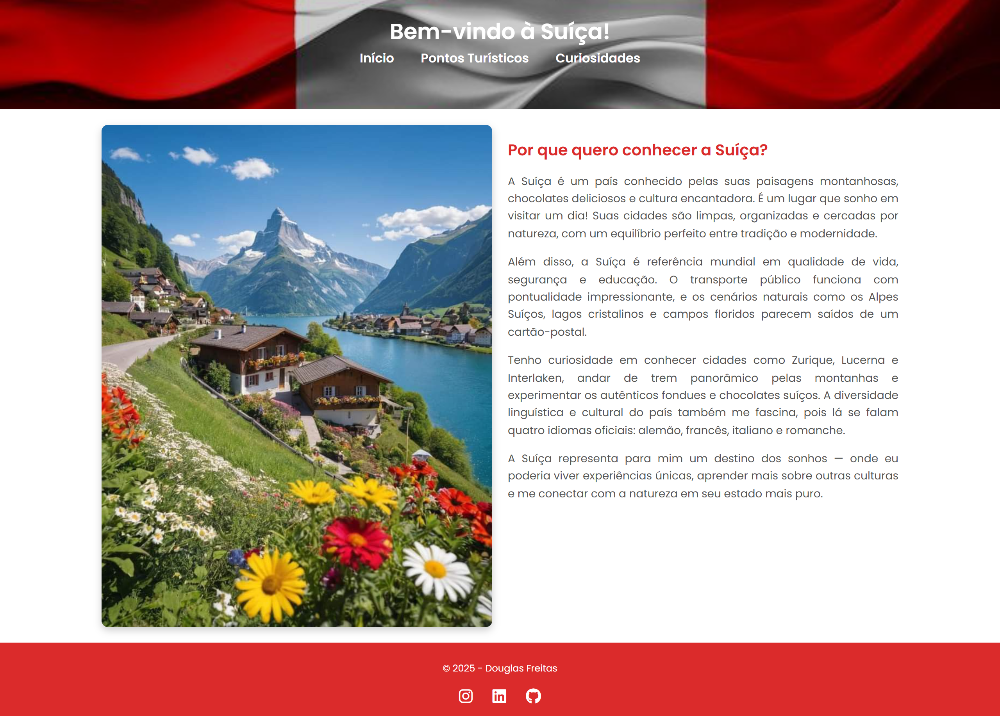
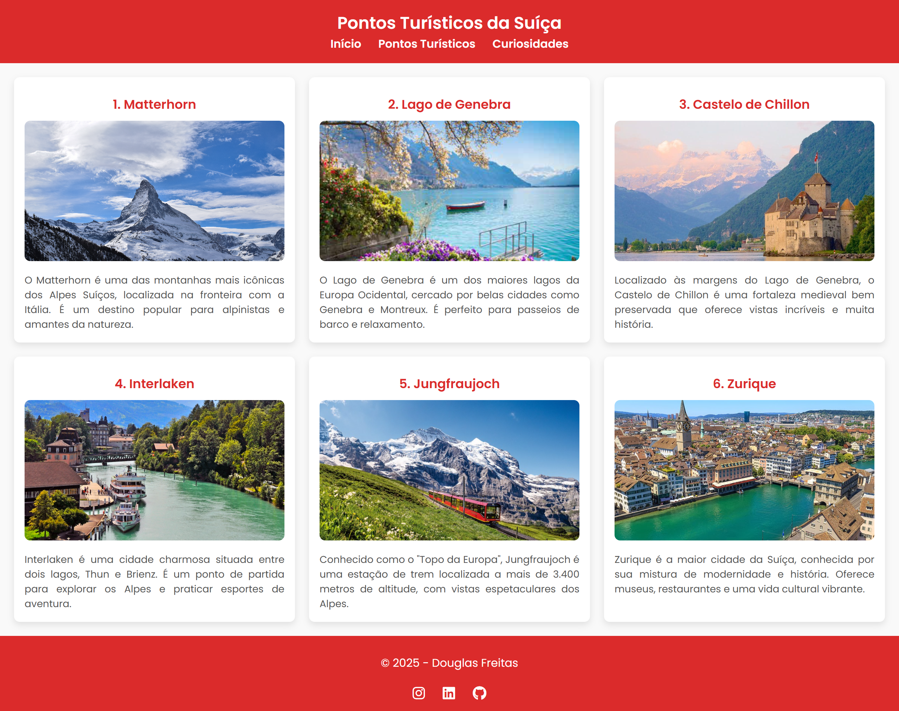
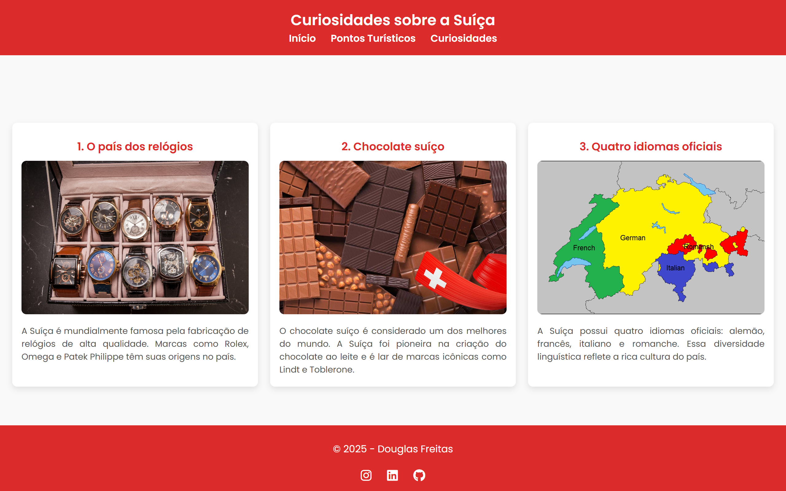

# Site - País Que Quero Conhecer

Este projeto é um site simples e responsivo que apresenta informações sobre a Suíça, um país que desejo conhecer. O site é dividido em três páginas principais: **Início**, **Pontos Turísticos** e **Curiosidades**. Cada página foi desenvolvida com HTML e CSS, com foco em organização, responsividade e design limpo.

---

## 🏠 Página Inicial



A página inicial apresenta uma introdução sobre a Suíça, destacando os motivos pelos quais o país é um destino dos sonhos. Nela, você encontrará:
- Um cabeçalho com o título do site e um menu de navegação.
- Uma imagem representativa da Suíça.
- Um texto explicativo sobre as razões para visitar o país, como suas paisagens, cultura e qualidade de vida.

---

## 🌍 Pontos Turísticos


A página de **Pontos Turísticos** destaca seis locais incríveis da Suíça, cada um com uma imagem e uma breve descrição. Os pontos turísticos apresentados são:
1. **Matterhorn**: Uma das montanhas mais icônicas dos Alpes Suíços.
2. **Lago de Genebra**: Um dos maiores lagos da Europa Ocidental, cercado por belas cidades.
3. **Castelo de Chillon**: Uma fortaleza medieval às margens do Lago de Genebra.
4. **Interlaken**: Uma cidade charmosa entre dois lagos, ideal para esportes de aventura.
5. **Jungfraujoch**: Conhecido como o "Topo da Europa", com vistas espetaculares dos Alpes.
6. **Zurique**: A maior cidade da Suíça, famosa por sua mistura de modernidade e história.

A página utiliza um layout em grade (grid) para organizar os pontos turísticos em três colunas, garantindo um design limpo e responsivo.

---

## 💡 Curiosidades


A página de **Curiosidades** apresenta três fatos interessantes sobre a Suíça, cada um acompanhado de uma imagem:
1. **Relógios Suíços**: A Suíça é famosa pela fabricação de relógios de alta qualidade, como Rolex e Omega.
2. **Chocolate Suíço**: O país é conhecido por produzir alguns dos melhores chocolates do mundo, como Lindt e Toblerone.
3. **Quatro Idiomas Oficiais**: Alemão, francês, italiano e romanche são os idiomas oficiais, refletindo a diversidade cultural do país.

A página também utiliza um layout em grade para exibir as curiosidades de forma organizada e responsiva.

---

## 🎨 Tecnologias Utilizadas
- **HTML5**: Estrutura do site.
- **CSS3**: Estilização e responsividade.
- **Font Awesome**: Ícones para redes sociais no rodapé.
- **Google Fonts**: Fonte estilosa para o texto (Poppins).

---

## 📱 Responsividade
Todas as páginas foram projetadas para serem responsivas, garantindo uma boa experiência em dispositivos móveis, tablets e desktops. O layout se adapta automaticamente ao tamanho da tela, ajustando colunas e espaçamentos.

---

## 🚀 Como Executar o Projeto
1. Clone este repositório:
   ```bash
   git clone https://github.com/dougffjw/Suica